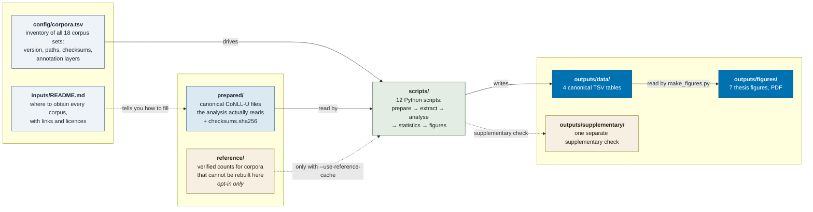

# Word order in Slovenian: reproducibility package

Reproduces the quantitative analyses and the seven figures of a master's thesis on
subject–verb–object word order in Slovenian (University of Ljubljana, Digital
Linguistics). The study asks how the relative order of subject, verb and object
varies across standard written, spoken, web, encyclopaedic, parliamentary,
historical-prose and human-versus-machine-generated Slovenian, and whether
registers differ in how fixed or variable that order is.

All examples come from one query over dependency-annotated corpora:

```text
upos=VERB >nsubj upos=NOUN >obj upos=NOUN
```

The predicate must be a `VERB` and both arguments common nouns (`NOUN`), with
relations exactly `nsubj` and `obj`; subtypes and `iobj` are excluded. Every
matching subject × object pair is classified as SVO, SOV, VSO, VOS, OSV or OVS.

## What you can reproduce

Three levels apply to different corpora:

- **Level 1 — source-to-result.** You obtain the official release, this package
  builds the analysis corpus and extracts the counts on your machine.
- **Level 2 — prepared-input-to-result.** The exact analysed file is available to
  you, but this package cannot rebuild it from a public source. Counts are
  recomputed from that file, which is identified by SHA-256.
- **Level 3 — downstream-from-verified-counts.** The analysis corpus is not
  available, so stored counts verified at analysis time are used instead.

> **A cached count is a recorded analysis result, not a rebuilt corpus.** At level 3
> nothing is recomputed from text, and the corpus preparation behind those numbers
> cannot be rechecked. Every such row is marked `verified_reference_*` in the output.

Statistics, all seven figures and the supplementary check are recomputed in full
regardless. The **verified-cache workflow** is what an outside reader can run today;
the **full workflow** requires all 18 analysis corpora and never falls back to the
cache.

## Repository structure



Details live next to the data they describe: [`inputs/README.md`](inputs/README.md)
for corpus sources, versions, licences and preparation;
[`prepared/README.md`](prepared/README.md) for checksums and what is pinned;
[`reference/README.md`](reference/README.md) for what the cached counts are and how
they were verified.

## Data flow


## The corpora

18 analysis sets from 12 public resources plus one non-public essay pair. Sources,
versions, licences and preparation steps are in
[`inputs/README.md`](inputs/README.md).

| Corpus | Source / version | How you get it | Level |
|---|---|---|---|
| SSJ | UD Slovenian-SSJ r2.18 | rebuilt by this package | 1 |
| SST | UD Slovenian-SST r2.18 | rebuilt; NER step needs the annotation extras | 1 |
| SUK literary / publicistic / professional | SUK 1.1, via a composite prepared by the thesis supervisor | not distributed here pending a redistribution decision; runs from the composite | 2 |
| JANES News / Blog / Forum / Tweet | Janes-* 1.0, JANES v0.4 base; UD conversion prepared by the thesis supervisor | verified counts | 3 |
| JANES-Wiki | Janes-Wiki 1.0, Wikipedia talk pages | verified counts | 3 |
| CLASSLA-Wikipedia | CLASSLA-Wikipedia 1.0, Slovenian | public download, else verified counts | 1 / 3 |
| ParlaMint-SI | ParlaMint.ana 4.0 | public download, else verified counts | 1 / 3 |
| KDSP | KDSP 1.0 | verified counts | 3 |
| Human essays | Šolar 3.0, the 691 fourth-year secondary essays | verified counts | 3 |
| GPT-5 essays | AI-GenT 1.0, `sl/Solar/4y-ss/GPT-5/pap` | from AI-GenT, else verified counts | 2 / 3 |
| AI-GenT gpt-5 / GaMS-27B / gemma-2-27b | AI-GenT 1.0, `sl/Solar/4y-gs`, default prompt | public download | 1 |

No corpus files are tracked in this repository.

## Quickstart

```bash
git clone https://github.com/hulln/sl-word-order-repro.git
cd sl-word-order-repro
python3 -m venv .venv
.venv/bin/pip install -r requirements.txt
```

Extraction uses [STARK](https://github.com/clarinsi/STARK) (Krsnik & Dobrovoljc,
TLT 2025, <https://aclanthology.org/2025.tlt-1.5/>), which is not bundled; the
thesis used upstream commit `fd0202d` (`v3.1.0-3-gfd0202d`). This package runs
STARK with its own interpreter, so STARK's dependencies go into the same
environment, and then the workflow runs:

```bash
.venv/bin/pip install -r /path/to/STARK/requirements.txt
python3 scripts/run_all.py --stark /path/to/STARK/stark.py --use-reference-cache
```

Drop `--use-reference-cache` for the full workflow. `compute_statistics.py` and
`make_figures.py` need neither corpora nor STARK — they run from `outputs/data/`,
which holds the six-pattern counts, the summary with entropy, the named-entity
table and the statistical tests (χ², Jensen–Shannon, cosine, fixed-seed
permutation, Fisher, Holm). Only the stages that add a CLASSLA named-entity layer
need `requirements-annotation.txt`, which pulls in PyTorch.

## Supplementary check

`outputs/supplementary/` holds one check that sits outside the main 18-corpus
analysis: the H2 genre comparisons repeated on the SUK subset whose syntax is
manually checked, against the canonical SST. Run it with
`python3 scripts/supplementary_manual_subset.py`.

## Limitations

- **The full workflow is not currently achievable from public sources.** The four
  JANES sets, JANES-Wiki, KDSP and the human essays cannot be reconstructed in the
  form analysed; they are level 3.
- **The SUK composite** covers more of SUK than the release distributes as CoNLL-U
  and cannot be rebuilt from it. Its query-relevant layer (FORM, UPOS, HEAD,
  DEPREL) was verified identical to SUK 1.1. The prepared files are not
  distributed here pending a redistribution decision.
- **ParlaMint** concatenation order was not recorded, so the concatenated file is
  not byte-reproducible; order cannot change any count.
- **JANES-Wiki**: CLASSLA re-segmented the text, so the prepared file's sentence
  count is not established and the manifest pins none.
- **The essays**: the GPT-5 side is annotated with Trankit (AI-GenT's annotator);
  the human side's annotator is undocumented and only CLASSLA was ruled out. The
  two sets are comparable by matched design — 691 paired documents — not by a
  demonstrated identical annotation procedure. Neither base file carries NER; it is
  added deterministically by `scripts/add_ner_annotation.py`.
- **Named-entity results for automatically labelled sources are exploratory**: the
  criterion is the label on the argument's head token, not givenness or topicality.
  For Janes-News, the relationship between the analysed conversion and the public
  anonymised release could not be established.
- **`all_pairwise`** is computed over every pair mechanically and so includes pairs
  the thesis never compares — SSJ overlaps SUK by design. The prespecified tests
  are `h1_omnibus` and `h2_prespecified`.

## Licence and citation

Code and documentation: **MIT** ([`LICENSE`](LICENSE)).

MIT covers this repository only and grants no rights over any corpus. No corpus
files are distributed here; each keeps the licence of its original release —
listed in [`inputs/README.md`](inputs/README.md) — and several are non-commercial
or share-alike. To cite the package, see [`CITATION.cff`](CITATION.cff).
