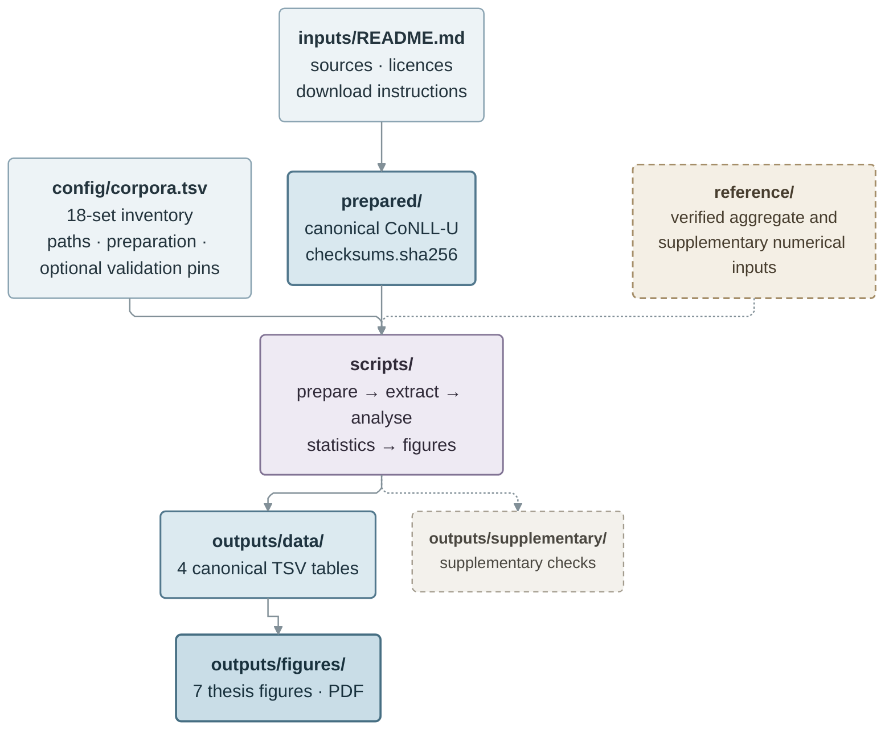
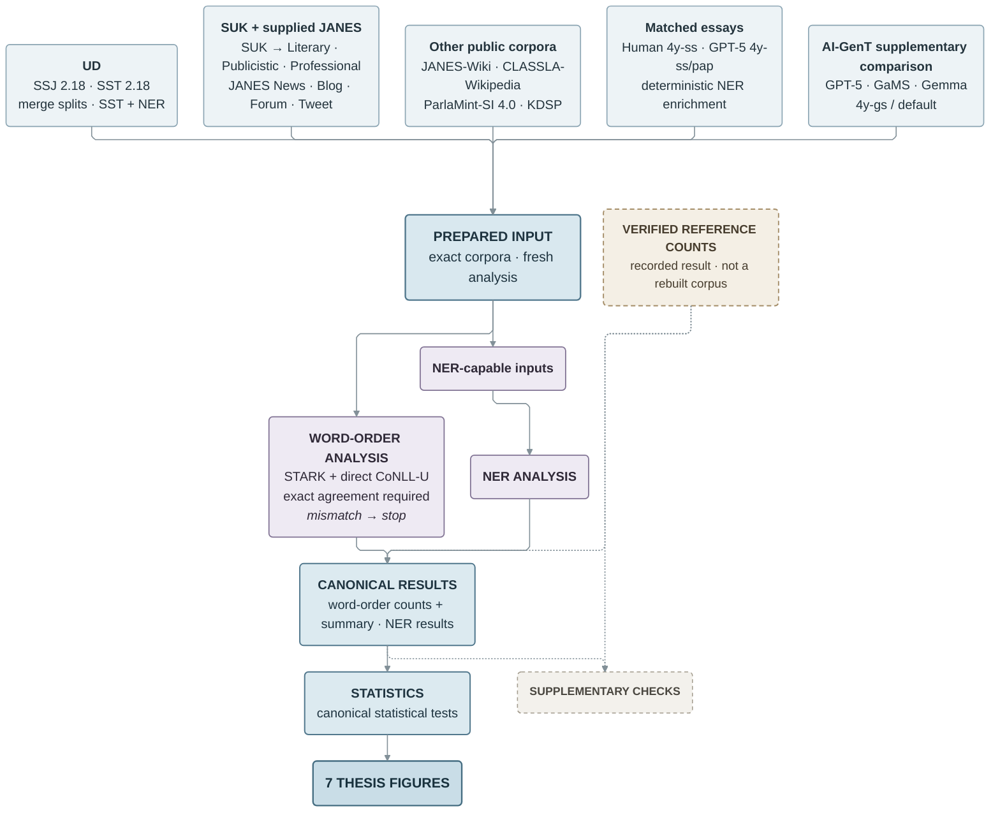

# Word order in Slovenian: reproducibility package

This repository accompanies a master's thesis on subject–verb–object word order
in Slovenian. It compares the six possible S/V/O orders across written, spoken,
web, parliamentary, historical and human-versus-machine-generated texts, runs
the thesis statistics and recreates the seven figures.

Some corpora can be rebuilt from public sources. For others, the exact analysed
file cannot be redistributed or reconstructed here, so the repository includes
previously verified aggregate counts instead.

## Main word-order query

The main analysis uses this dependency query:

```text
upos=VERB >nsubj upos=NOUN >obj upos=NOUN
```

It selects a `VERB` with `nsubj` and `obj` dependents, both headed by `NOUN`.
STARK runs with `label_subtypes=no`, so relation subtypes are collapsed to their
base labels for STARK matching, whereas the independent direct extractor
requires exact `nsubj` and `obj`. No `nsubj`/`obj` subtypes occur in the analysed
Slovenian prepared sources, so this distinction does not affect the reported
counts. `iobj` remains outside the query. All matching subject × object pairs are
counted and classified as SVO, SOV, VSO, VOS, OSV or OVS.

The separate named-entity analysis uses the same relations but allows `NOUN` or
`PROPN` argument heads.

## What a fresh clone contains

No CoNLL-U corpus files are tracked in Git. A fresh clone contains the numerical
results, statistics and figures, plus verified stored counts for corpora that may
be unavailable. It does not contain prepared corpora.

## Repository structure



Details live next to the data they describe: [`inputs/README.md`](inputs/README.md)
for corpus sources, versions, licences and preparation;
[`prepared/README.md`](prepared/README.md) for checksums and what is pinned;
[`reference/README.md`](reference/README.md) for what the stored counts are and how
they were verified; and
[`outputs/supplementary/README.md`](outputs/supplementary/README.md) for the
supplementary analyses.

## Data flow



## Corpus routes

The 18 analysis sets do not all enter the workflow in the same way:

| Corpus | Available route |
|---|---|
| SSJ; SST | Rebuild from the public UD 2.18 releases. SST also needs the annotation dependencies. |
| SUK literary / publicistic / professional | Reanalyse from the exact supervisor-prepared composite or derived files. The public SUK CoNLL-U is not the same corpus. |
| JANES News / Blog / Forum / Tweet | Reanalyse if the exact supervisor-prepared files are available; otherwise use verified stored counts. |
| JANES-Wiki; KDSP | The historical preparation is not runnable here; use verified stored counts unless the exact prepared files are available. |
| CLASSLA-Wikipedia; ParlaMint-SI | Rebuild from the public releases, or use verified stored counts. |
| Human essays | Reanalyse from the prepared matched subset if available; otherwise use verified stored counts. |
| GPT-5 essays | Normalize the AI-GenT essay cell to the pinned base file, then add NER; preparation performs only the NER step. Otherwise use verified stored counts. |
| AI-GenT supplementary GPT-5 / GaMS-27B / gemma-2-27b | Copy the public analysis-ready `4y-gs`, default-prompt files. |

Sources, exact paths, licences and caveats are in
[`inputs/README.md`](inputs/README.md).

## Statistical outputs

Main statistics are in `outputs/data/statistical_tests.tsv`. The manually
reviewed and robustness analyses are kept separately under
`outputs/supplementary/` and are described in its local README. Run
`scripts/supplementary_manual_subset.py` and
`scripts/supplementary_robustness.py` to reproduce them.

## Run from a fresh clone

```bash
git clone https://github.com/hulln/sl-word-order-repro.git
cd sl-word-order-repro
python3 -m venv .venv
.venv/bin/pip install -r requirements.txt
python3 scripts/compute_statistics.py
python3 scripts/supplementary_manual_subset.py
python3 scripts/supplementary_robustness.py
python3 scripts/make_figures.py
```

These commands recompute the summary, main statistical tests, all supplementary
checks, and seven figures from the included numerical tables. They need neither
corpora nor STARK. The robustness script takes roughly one minute on a typical
laptop because it performs the frozen 20,000-permutation checks.

## Rerun extraction

First obtain the corpus files described in [`inputs/README.md`](inputs/README.md).
Extraction also needs [STARK](https://github.com/clarinsi/STARK); the thesis used
commit `fd0202d` (`v3.1.0-3-gfd0202d`). Install its requirements in the same
environment, then run:

```bash
.venv/bin/pip install -r /path/to/STARK/requirements.txt
python3 scripts/run_all.py --stark /path/to/STARK/stark.py --use-reference-cache
```

This is not a fresh-clone command. The reference option covers ten corpora only;
SSJ, SST, the three SUK subsets and the three AI-GenT `4y-gs` files must already
exist under `prepared/`. Without `--use-reference-cache`, all 18 prepared files
are required. Only preparation steps that add CLASSLA NER need
`requirements-annotation.txt`.

## Limitations

- The full extraction cannot be completed from public sources alone: the exact
  SUK composite, four JANES conversions, JANES-Wiki preparation, KDSP preparation
  and human essay file are not distributed here.
- The SUK composite is wider than the public CoNLL-U release. Where comparison
  was possible, its query-relevant fields matched SUK 1.1.
- ParlaMint is rebuilt by concatenating the distributed CoNLL-U files in
  lexicographically sorted full-path order.
- The 691 human and GPT-5 essays are matched by document. GPT-5 syntax comes from
  AI-GenT; the human syntactic annotator remains undocumented in the available
  provenance evidence.
- The supplementary AI-GenT `4y-gs` comparison uses different generated texts
  and prompts. Its 205 GPT-5 source documents overlap the matched 691, so it is
  not an independent replication.
- Automatically labelled NER results are exploratory and classify only the
  argument head token.
- `all_pairwise` includes mechanical comparisons outside the thesis hypotheses.
  The prespecified tests are `h1_omnibus` and `h2_prespecified`.

## Licence and citation

Code and repository content: **GNU GPL version 3 or later**
([`LICENSE`](LICENSE); SPDX: `GPL-3.0-or-later`).

The GPL covers this repository only and grants no rights over any corpus. No
corpus files are distributed here; each keeps the licence of its original
release — listed in [`inputs/README.md`](inputs/README.md) — and several are
non-commercial or share-alike. To cite the package, see
[`CITATION.cff`](CITATION.cff).
