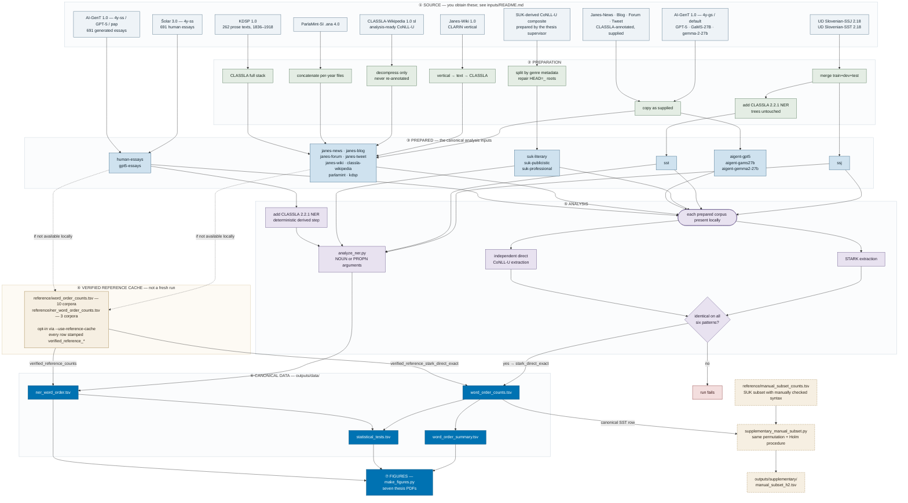

# Word order in Slovenian: reproducibility package

This repository reproduces the quantitative analyses and the seven figures of a
master's thesis on subject–verb–object (S/V/O) word order in Slovenian
(University of Ljubljana, Digital Linguistics).

The study asks how the relative order of subject, verb and object varies across
different kinds of Slovenian text — standard written, spontaneous speech, five
web registers, encyclopaedic articles, parliamentary transcripts, historical
prose, and human versus machine-generated student essays — and whether registers
differ in how *fixed* or *variable* that order is.

Every example is extracted with one query over dependency-annotated corpora:

```text
upos=VERB >nsubj upos=NOUN >obj upos=NOUN
```

The predicate must be a `VERB`; both arguments must be common nouns (`NOUN`);
relations must be exactly `nsubj` and `obj`. Relation subtypes and `iobj` are
excluded. Every matching subject × object pair is classified as one of SVO, SOV,
VSO, VOS, OSV or OVS.

## What you can reproduce, and at which level

Reproducibility is not one thing here. Three different levels apply to different
corpora, and the difference matters:

1. **Source-to-result.** You download the official release, this package builds
   the analysis corpus from it, and the counts are extracted on your machine.
   Nothing is taken on trust.
2. **Analysis-from-prepared-input.** The exact analysis corpus is not something
   this package can build for you — it was prepared elsewhere — but if you hold
   that file, every count from it is recomputed on your machine. The file is
   identified by SHA-256 so you can confirm you hold the right one.
3. **Downstream-from-verified-counts.** The analysis corpus is not available to
   you at all, so the pipeline reads stored counts that were verified when the
   corpus was analysed. **Nothing is recomputed from text for these corpora.**
   The statistics and figures built on top of them are recomputed in full.

Level 3 is *not* a weaker version of level 1. A cached count is a recorded
result, not a rebuilt corpus: it tells you what the analysis found, and it does
not let you check the corpus preparation behind it.

| | Verified-cache workflow | Full workflow |
|---|---|---|
| Word-order counts | 8 corpora at level 1 or 2; 10 at level 3 | all 18 at level 1 or 2 |
| Named-entity counts | 5 corpora recomputed; 3 at level 3 | all 8 recomputed |
| Statistics | **recomputed in full** | recomputed in full |
| Seven figures | **regenerated in full** | regenerated in full |
| Supplementary H2 check | **recomputed in full** | recomputed in full |

The verified-cache workflow is what an outside reader can realistically run
today. It recomputes every corpus you can obtain and reads stored counts only
where the corpus is unavailable, marking every such row in the output. The full
workflow refuses to start unless all 18 analysis corpora are present, and never
falls back to the cache.

Which corpus sits at which level is stated per corpus in the table below.

## What is in this repository


- **`config/corpora.tsv`** — the machine-readable inventory. One row per corpus
  set: version, expected file, checksum, sentence count, which annotation layers
  are gold and which automatic, and which analyses use it.
- **`inputs/README.md`** — the download guide. For every corpus: official source
  with a working link, exact release, licence, expected filename, and what
  preparation turns it into a canonical file.
- **`prepared/`** — the canonical CoNLL-U files that analysis reads. Analysis
  scripts never read raw sources directly.
- **`reference/`** — verified aggregate counts for the ten corpora that cannot be
  rebuilt from this package. Used only when you ask for it.
- **`scripts/`** — the whole pipeline, eleven small Python files.
- **`outputs/`** — the canonical results: four data tables and seven figures,
  plus `outputs/supplementary/` for one clearly separated supplementary check.

The `.conllu` corpus files are **not tracked in Git** (see
[Obtaining the corpora](#obtaining-the-corpora)).

## How the data flows

The 18 analytical sets come from 12 public resources plus one non-public essay
pair. SUK contributes three genre subsets and AI-GenT contributes four sets, so
the number of downloads is much smaller than the number of analysis corpora.



Two things in that diagram matter more than the rest.

**The exact-equality check.** For every corpus actually present, the pipeline runs
the thesis method (STARK) *and* an independently written extractor over the same
file, and requires them to agree on all six pattern counts. If they disagree the
run stops. This is why output rows are stamped `stark_direct_exact`.

**The cache is never disguised as a fresh run.** Cached corpora enter the results
through a separate, opt-in path and every row they produce carries a
`verified_reference_*` status in the output file itself. Reading
`outputs/data/word_order_counts.tsv`, you can always tell which numbers were
recomputed on your machine and which were not.

## The corpora

No corpus files are tracked in this repository. The **How you get it** column
says what you must do; the **Level** column is the reproducibility level defined
above (1 = source-to-result, 2 = analysis-from-prepared-input, 3 =
downstream-from-verified-counts).

| Corpus | Source and version | Preparation | How you get it | Licence | Level |
|---|---|---|---|---|---|
| **SSJ** | [UD Slovenian-SSJ, r2.18](https://github.com/UniversalDependencies/UD_Slovenian-SSJ/tree/r2.18) | merge train+dev+test | rebuilt from the official release by this package, one command | CC BY-SA 4.0 | **1** |
| **SST** | [UD Slovenian-SST, r2.18](https://github.com/UniversalDependencies/UD_Slovenian-SST/tree/r2.18) | merge, then add CLASSLA 2.2.1 NER without altering the trees | rebuilt from the official release; the NER step needs the annotation extras | CC BY-SA 4.0 | **1** |
| **SUK** literary / publicistic / professional | SUK 1.1 ([11356/1959](http://hdl.handle.net/11356/1959)), analysed through a composite prepared by the thesis supervisor | split by `zvrst` genre metadata; repair `HEAD=_` roots | not distributed here while a redistribution decision is pending; runs normally if you hold the composite | source corpus CC BY-SA 4.0; composite: decision pending | **2** |
| **JANES-News** | Janes-News 1.0 ([11356/1140](http://hdl.handle.net/11356/1140)), JANES v0.4 base; UD conversion prepared and annotated by the thesis supervisor | copy as supplied | CLARIN distributes TEI/vertical, not this UD conversion; verified counts used instead | corpus CC BY 4.0 | **3** |
| **JANES-Blog** | Janes-Blog 1.0 ([11356/1138](http://hdl.handle.net/11356/1138)), same route | copy as supplied | same | corpus CC BY 4.0 | **3** |
| **JANES-Forum** | Janes-Forum 1.0 ([11356/1139](http://hdl.handle.net/11356/1139)), same route | copy as supplied | same | corpus CC BY 4.0 | **3** |
| **JANES-Tweet** | Janes-Tweet 1.0 ([11356/1142](http://hdl.handle.net/11356/1142)), same route | copy as supplied | same; Twitter access constraints also apply to the source | corpus CC BY-NC 4.0 | **3** |
| **JANES-Wiki** | Janes-Wiki 1.0 ([11356/1137](http://hdl.handle.net/11356/1137)), Wikipedia talk pages | vertical → sentence text → CLASSLA 2.2.1 | source is public; the annotation step is documented but its wrapper is not shipped, so verified counts are used | CC BY-SA 4.0 | **3** |
| **CLASSLA-Wikipedia** | CLASSLA-Wikipedia 1.0, Slovenian ([11356/1427](http://hdl.handle.net/11356/1427)), encyclopaedic articles | decompress only — used exactly as distributed | public download; this package prepares it, or use the verified counts | CC BY 4.0 | **1** if you download it, otherwise 3 |
| **ParlaMint-SI** | ParlaMint.ana 4.0 ([11356/1860](http://hdl.handle.net/11356/1860)) | concatenate the per-year CoNLL-U files | public download; this package prepares it, or use the verified counts | CC BY 4.0 | **1** if you download it, otherwise 3 |
| **KDSP** | KDSP 1.0 ([11356/1823](http://hdl.handle.net/11356/1823)) | CLASSLA 2.2.1 full stack over the release text | source is public; the annotation wrapper is not shipped, so verified counts are used | CC BY 4.0 | **3** |
| **Human essays** | Šolar 3.0 ([11356/1589](http://hdl.handle.net/11356/1589)) — the 691 fourth-year secondary-school essays forming AI-GenT's `4y-ss` subset | supplied already syntactically annotated; NER added by this package | the source corpus is public, this annotated subset is not published as such; verified counts used | Šolar 3.0 CC BY-NC-SA 4.0; annotated subset: status unestablished | **3** |
| **GPT-5 essays** | AI-GenT 1.0, cell `sl/Solar/4y-ss/GPT-5/pap` ([11356/2210](http://hdl.handle.net/11356/2210)) | supplied already annotated; NER added by this package | obtainable from AI-GenT; verified counts used otherwise | CC BY-NC-SA 4.0 | **2** if you obtain it, otherwise 3 |
| **AI-GenT** gpt-5 / GaMS-27B / gemma-2-27b | AI-GenT 1.0, cell `sl/Solar/4y-gs`, default prompt | copy as distributed | public download from CLARIN.SI | CC BY-NC-SA 4.0 | **1** |

The three SUK rows are derived analysis corpora, not three downloads. The four
AI-GenT rows come from one release.

**A note on SUK.** The file the thesis analysed is a UD CoNLL-U composite of four
SUK 1.1 components, prepared by the thesis supervisor. It is pinned by SHA-256
(`03f9222d6e9e86b4d5aab50fd11781127f3f6f3e1b017039a0d3d2d3889ebc5c`), and from
that exact file the genre split and every downstream result reproduce here. Its
construction cannot currently be recreated from the public SUK release, which
distributes only part of the corpus as CoNLL-U. The three prepared SUK files are
**not distributed in this repository while a redistribution decision is pending**;
this is an open question, not a refusal.

## Obtaining the corpora

Corpus files are not stored in Git. `inputs/README.md` documents, per corpus, the
official record, the exact release, the licence, the expected filename and the
preparation step. In short:

- **SSJ and SST** rebuild themselves:
  `python3 scripts/prepare_corpora.py --download-ud --force`
- **AI-GenT** (four sets, including the GPT-5 essays) comes from CLARIN.SI
  [11356/2210](http://hdl.handle.net/11356/2210).
- **CLASSLA-Wikipedia** and **ParlaMint-SI** are public downloads; the package
  prepares them for you if you place them as documented.
- **The three SUK genre corpora** are not distributed here: the composite they
  derive from was prepared by the thesis supervisor, and a redistribution
  decision has not yet been made. If you hold the composite, the split and
  everything downstream run normally.
- **The four JANES corpora, JANES-Wiki, KDSP and the human essays** are not
  publicly obtainable in the exact form analysed, so their verified counts are
  in `reference/` and the analysis for them runs at level 3.

`prepared/checksums.sha256` and `config/corpora.tsv` let you confirm that any file
you obtain is the one the thesis analysed.

## Running it

```bash
python3 -m venv .venv
.venv/bin/pip install -r requirements.txt
```

That is everything the lightweight workflow needs. Only the two stages that add
a CLASSLA named-entity layer — rebuilding `prepared/sst.conllu` from UD, and
adding NER to the essay base corpora — need the heavier extras, which pull in
PyTorch:

```bash
.venv/bin/pip install -r requirements-annotation.txt
```

STARK is the extraction tool and is not bundled. It is public:
<https://github.com/clarinsi/STARK>, described by Krsnik and Dobrovoljc, *STARK:
A Toolkit for Dependency (Sub)Tree Extraction and Analysis* (TLT 2025,
<https://aclanthology.org/2025.tlt-1.5/>). The thesis runs used STARK at upstream
commit `fd0202d` (`v3.1.0-3-gfd0202d`).

This package runs STARK with the same Python interpreter as itself, so STARK's own
dependencies must be installed into the same environment:

```bash
.venv/bin/pip install -r /path/to/STARK/requirements.txt
```

You only need this for the extraction stage. `compute_statistics.py` and
`make_figures.py` do not use STARK at all.

**Lightweight mode** — recompute everything you have, use verified counts for the
rest:

```bash
python3 scripts/run_all.py --stark /path/to/STARK/stark.py --use-reference-cache
```

**Full mode** — requires all 18 prepared corpora and never falls back to the
cache; it fails explicitly if any is missing:

```bash
python3 scripts/run_all.py --stark /path/to/STARK/stark.py
```

Individual stages:

```bash
python3 scripts/prepare_corpora.py
python3 scripts/extract_word_order.py --stark /path/to/STARK/stark.py --use-reference-cache
python3 scripts/analyze_ner.py --use-reference-cache
python3 scripts/compute_statistics.py
python3 scripts/make_figures.py
```

`compute_statistics.py` and `make_figures.py` need no corpora at all — they run
from the canonical tables in `outputs/data/`.

## Outputs

- `word_order_counts.tsv` — 18 corpora × 6 patterns, with an extraction-status
  column distinguishing recomputed from cached rows.
- `word_order_summary.tsv` — proportions, dominant order and Shannon entropy.
- `ner_word_order.tsv` — role × named-entity status × word order.
- `statistical_tests.tsv` — χ², Jensen–Shannon distance, cosine similarity,
  fixed-seed permutation tests, Fisher exact tests and Holm adjustments. The
  `all_pairwise` family is computed mechanically over every pair, so it also
  contains pairs the thesis deliberately never compares — in particular SSJ
  overlaps SUK by design, and the thesis never places them in the same
  comparison. The prespecified hypothesis tests are the `h1_omnibus` and
  `h2_prespecified` families.
- `outputs/figures/` — the seven thesis figures, regenerated from the tables above.

## What is cleaned before extraction

STARK's CoNLL-U reader rejects constructions several of these corpora contain, so
each file is split into chunks at sentence boundaries and repaired on the way: a
root written as `HEAD=_` with `DEPREL=root` becomes `HEAD=0`; a FEATS or DEPS
field that is not valid CoNLL-U is blanked; a sentence in which any other token
has no numeric head is dropped. Counts of these repairs are printed whenever they
occur.

None of this can move a number. The query reads only UPOS and DEPREL, and a
sentence with no syntax cannot match a dependency query. The independent
extractor applies none of these repairs and reads each file as distributed, so
the required exact agreement between the two methods is also the check that the
cleaning was inert.

## Supplementary checks

Two checks in the thesis sit outside the main 18-corpus analysis. They are
reported here so that their status is unambiguous.

**Manually checked genre subset.** Part of the genre-annotated SUK material
carries automatically added syntax. The thesis therefore repeats the four H2
genre comparisons on the subset whose dependency syntax is manually checked.
This package reproduces that check:

```bash
python3 scripts/supplementary_manual_subset.py
```

It reads the subset distributions from `reference/manual_subset_counts.tsv` —
they come from an analysis that needs the SUK composite and so cannot be rerun
here — takes the SST distribution from the canonical
`outputs/data/word_order_counts.tsv`, and applies the same permutation and Holm
procedure as the main statistics. The result is written to
`outputs/supplementary/manual_subset_h2.tsv`. On this smaller subset the
descriptive measures still run in the predicted direction, but no comparison
remains significant after Holm adjustment.

**Parser-robustness check.** The thesis also reports an auxiliary check in which
the SSJ treebank was parsed again automatically and compared with its manually
checked annotation sentence by sentence: the word-order pattern was identical
for 99.55 % of the instances that could be aligned, while the aggregate SVO share
moved by about 2.3 percentage points because automatic parsing changes *which*
instances match the query. That check was run on an earlier SSJ working copy,
before the move to UD 2.18, and its input cannot be reconstructed from public
sources. It is therefore described in the thesis as an auxiliary methodological
check and is **not** part of the results in this package; no output for it is
published here, because the historical input cannot be shipped and the check
cannot be rerun against it.

## Limitations

- **Full mode is not currently achievable by an outside reader.** Several exact
  prepared corpora — the four JANES sets, JANES-Wiki, KDSP and the human essays —
  cannot be reconstructed from public sources in the form analysed. Lightweight
  mode is the honest maximum, and it still regenerates every statistic and figure.
- **The SUK composite is not an official download.** It was prepared by the thesis
  supervisor and covers more of SUK than the release distributes as CoNLL-U. Its
  query-relevant layer was verified against SUK 1.1: form, UPOS, HEAD and DEPREL
  are identical, the only differences being 262 FEATS values that no analysis here
  reads. The genre split and everything downstream is reproducible from the exact
  file; the composite itself is not rebuildable from the public release, and the
  prepared SUK files are not distributed here pending a redistribution decision.
- **ParlaMint concatenation order is not recorded**, so the concatenated file is
  not byte-reproducible. Concatenation order cannot change any count, because it
  does not change which sentences are present.
- **JANES-Wiki sentence count is not pinned.** The source vertical contained
  390,525 sentences, but CLASSLA re-segmented the text, so the prepared file's own
  sentence count is not established and the manifest asserts none.
- **The human essays' syntactic annotator is not documented.** The GPT-5 side is
  documented by AI-GenT as Trankit with a custom Slovenian UD v2.15 model. For the
  human side the annotator is unknown; re-annotation established only that neither
  set was annotated with CLASSLA-Stanza. The two sets are comparable by matched
  design — 691 paired documents from the same source texts — but identical
  annotation procedure has not been demonstrated.
- **Named-entity results for automatically labelled sources are exploratory.** The
  named-entity criterion is the label on the argument's head token; it does not
  measure givenness, topicality or referent status.
- **The essay base corpora contain no NER layer.** NER is added as a deterministic
  derived step by `scripts/add_ner_annotation.py`, which asserts that nothing
  outside the MISC column changes. Regenerating it reproduces the cached essay
  named-entity counts exactly.
- For Janes-News, the relationship between the analysed conversion and the public
  anonymised release could not be established from the available evidence.
- The supplementary parser-robustness check described above cannot be rerun from
  this package; see that section for what it does and does not show.

## Licence

The code and documentation written for this repository are released under the
**MIT Licence** ([`LICENSE`](LICENSE)).

**MIT covers this repository's own code and documentation, and nothing else.** It
grants no rights whatsoever over the language corpora the pipeline analyses. No
corpus files are distributed here. Every corpus keeps the licence of its original
release — listed per corpus in the table above and in `inputs/README.md` — and
several are non-commercial or share-alike. Consult the linked record before
redistributing any corpus data.

## Citation

See [`CITATION.cff`](CITATION.cff).
